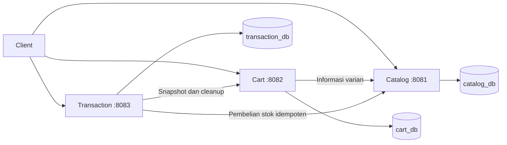

# Keputusan desain

## Domain dan batas service

- Catalog dan detail produk berada di satu service karena menggunakan data bisnis yang sama.
- Cart mempunyai siklus perubahan sendiri; menambah barang tidak mengurangi stok.
- Transaction menyimpan sejarah pembelian secara mandiri.
- Satu checkout berisi banyak `transaction_orders`, masing-masing untuk satu toko. Satu pesanan memiliki banyak `transaction_items`.

## Relasi database

| Induk | Anak | Relasi | Lokasi |
|---|---|---|---|
| stores | products | 1 ke banyak melalui store_id | FK Catalog |
| products | product_variants | 1 ke banyak melalui product_id | FK Catalog |
| carts | cart_items | 1 ke banyak melalui cart_id | FK Cart |
| transactions | transaction_orders | 1 ke banyak melalui transaction_id | FK Transaction |
| transaction_orders | transaction_items | 1 ke banyak melalui transaction_order_id | FK Transaction |
| product_variants | cart_items | 1 ke banyak melalui variant_id | Referensi lintas service |
| product_variants | transaction_items | 1 ke banyak melalui variant_id | Referensi lintas service |
| stores | transaction_orders | 1 ke banyak melalui store_id | Referensi lintas service |

`customer_id` merupakan referensi ke sistem profil eksternal yang diasumsikan sudah tersedia. Tidak ada FK lintas database. Database menggunakan role berbeda; akses CONNECT publik dicabut di init.sql.

## Perbedaan implementasi dari ERD ringkas

Delapan tabel bisnis tetap dipertahankan. Implementasi menambah:

- `cart_items.version`: mencegah cleanup tertunda menghapus item yang baru diedit.
- Kolom internal `transactions.idempotency_key`, `request_json`, `cart_snapshot`, `cart_cleaned`, dan `failure_reason`: menyimpan progres checkout sehingga dapat dilanjutkan setelah gangguan.
- Tabel teknis Catalog `stock_operations`: menyimpan request dan hasil pengurangan stok dengan kunci unik checkout. Ini diperlukan karena transaksi database lokal tidak mencakup panggilan HTTP.
- `flyway_schema_history`: dibuat otomatis oleh Flyway.

Field `variant_name` cukup untuk pilihan seperti "16GB / 512GB / Silver" pada scope practice. Sistem atribut dinamis yang dinormalisasi belum diperlukan.

## Alur checkout dan konsistensi

1. Client mengirim item keranjang terpilih, penerima, alamat, layanan kurir, serta `Idempotency-Key`.
2. Transaction mengunci proses inisiasi per pelanggan, memeriksa key dan kepemilikan item, lalu menyimpan intent `PENDING` beserta snapshot keranjang dalam transaksi lokal.
3. Setelah intent committed, Transaction meminta Catalog memproses stok dengan ID transaksi sebagai operation key.
4. Catalog mengunci operation key dan baris varian dalam urutan ID. Semua stok diperiksa/dikurangi dalam **satu transaksi PostgreSQL**. Hasilnya disimpan di `stock_operations` dalam commit yang sama.
5. Transaction menyalin nama toko, nama barang, varian, harga, dan catatan; membuat pesanan per toko; menghitung total; lalu melakukan commit status `CREATED`.
6. Cart menghapus hanya item dengan ID dan versi yang masih sama seperti snapshot. Barang tidak terpilih dan perubahan setelah checkout tidak dihapus.

Nominal dari client tidak digunakan. Seluruh harga diambil dari Catalog saat proses stok dan disimpan sebagai snapshot. Total dihitung dalam rupiah menggunakan `long`/`BIGINT`.

Jika validasi stok ditolak definitif, seluruh pengurangan stok dalam request di-rollback oleh Catalog, transaksi menjadi `FAILED`, dan keranjang tetap utuh.

Jika koneksi putus setelah Catalog commit, Transaction tidak mengetahui hasil secara pasti. Status tetap `PENDING`; worker mengulangi operation key yang sama. Catalog mengembalikan hasil tersimpan tanpa mengurangi stok kembali. Pemulihan maju ini digunakan karena scope tidak mencakup pembatalan/pembayaran. Tidak ada klaim transaksi ACID lintas microservices.

Cleanup keranjang juga dapat diulang tanpa efek ganda. Pembelian yang sudah dibuat tidak dibatalkan hanya karena cleanup sementara gagal. Satu pelanggan hanya boleh memiliki satu checkout yang masih pending atau menunggu cleanup agar checkout lain tidak memakai keranjang yang sama secara bersamaan.

## Trade-off

- JdbcTemplate membuat query, transaksi, dan penguncian stok terlihat jelas untuk penilaian practice; tidak memerlukan pemetaan entity ORM.
- Data relasional utama menggunakan PostgreSQL; JSONB hanya untuk payload recovery internal.
- Database per service mengurangi keterikatan schema, dengan konsekuensi konsistensi antarlayanan perlu retry.
- Panggilan HTTP dilakukan dengan timeout. Worker memproses sampai 20 transaksi outstanding setiap putaran; desain ini ditujukan untuk volume practice, bukan throughput marketplace besar.
- Pemulihan permanen yang tidak dapat selesai memerlukan penanganan operator berdasarkan log dan transaksi `PENDING`; sistem monitoring operasional di luar scope.
- Pencarian menggunakan query parametrik dengan substring case-insensitive. Search engine, cache, event broker, dan gateway dapat ditambahkan bila kebutuhan meningkat.
